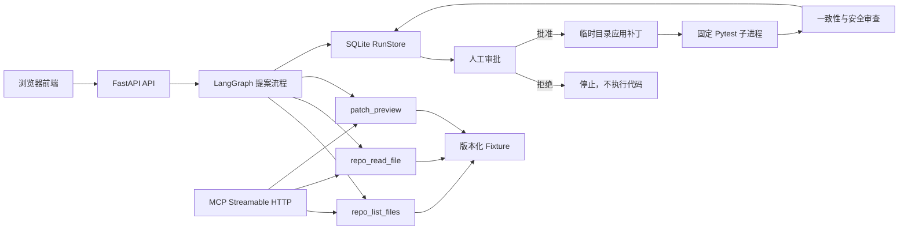

# PatchPilot 项目入门与接手指南

> 适用对象：第一次接触 Agent、LangGraph、MCP、FastAPI 和软件维护自动化的开发者。
> 当前版本：0.1.0
> 在线演示：https://patchpilot-agent-production.up.railway.app/

## 1. 先用一句话理解项目

PatchPilot 是一个带人工审批的软件维护 Agent 演示系统：它先读取固定的示例仓库并生成补丁预览，只有用户明确批准后，才会在临时目录中应用补丁、运行真实 Pytest，并保存完整执行轨迹。

## 2. 当前版本到底实现了什么

### 2.1 已经实现

- 使用 LangGraph 编排仓库检查、计划生成和补丁预览。
- 使用官方 MCP Python SDK 暴露三个只读工具。
- 使用 FastAPI 提供任务、运行记录和审批接口。
- 使用 SQLite 保存运行状态、审批记录、Diff、测试输出和审查结果。
- 人工批准后，在临时 fixture 副本中应用固定补丁。
- 使用子进程执行真实的 `python -m pytest -q`。
- 提供 10 秒测试超时、输出截断、路径校验和请求限流。
- 使用 Docker 部署到 Railway。
- 提供桌面端和移动端交互界面。

### 2.2 当前没有实现

- 不调用大语言模型 (Large Language Model, LLM) API。
- 不分析任意 GitHub 仓库。
- 不接受用户上传代码。
- 不允许用户输入任意文件路径或 Shell 命令。
- 不创建真实分支、提交或 Pull Request。
- 不执行 Docker-in-Docker 隔离。
- 不适合直接执行不可信代码。
- 不支持多实例共享 SQLite 状态。

因此，当前项目应准确描述为：

> 一个基于 LangGraph、MCP 和人工审批门控的确定性软件维护 Agent 工作流演示。

不能描述为：

> 已经能够自动修复任意 GitHub Issue 的生产级编码 Agent。

## 3. 为什么还可以称为 Agent 项目

Agent 应用不只等于“调用一次大模型”。一个可执行 Agent 系统通常包含：

1. 状态：系统当前处理哪个任务，处于哪个阶段。
2. 角色：仓库分析、计划、补丁、测试和审查。
3. 工具：读取文件、生成 Diff、执行测试。
4. 决策边界：哪些动作可以自动执行，哪些必须审批。
5. 轨迹：每一步输入、输出、耗时和结果。
6. 恢复能力：中断后能够读取已保存状态。

PatchPilot 已实现以上工程结构，但“生成补丁”目前使用预定义规则，不是 LLM 动态生成。

## 4. 用户实际操作流程

在线页面提供两个固定任务：

| 任务 | 问题 | 目标文件 |
|---|---|---|
| `python-average-empty` | `average([])` 触发除零异常 | `calculator.py` |
| `python-slug-separators` | 连续分隔符产生多个连字符 | `slug.py` |

一次完整操作如下：

1. 用户选择任务。
2. 前端调用 `POST /api/runs`。
3. LangGraph 读取 fixture 文件。
4. 系统生成四步维护计划。
5. 系统生成 Unified Diff，但不修改文件。
6. 运行状态变为 `awaiting-approval`。
7. 用户查看 Diff。
8. 用户选择“拒绝”或“批准并测试”。
9. 拒绝：运行结束，不执行任何代码。
10. 批准：系统复制 fixture 到临时目录。
11. 系统只修改允许列表中的目标文件。
12. 系统执行固定 Pytest 命令。
13. Review Agent 检查测试结果和 Diff 一致性。
14. 最终状态变为 `completed` 或 `failed`。
15. 所有结果写入 SQLite。

## 5. 系统架构



### 5.1 两条访问路径

系统中有两条不同路径：

| 路径 | 调用者 | 功能 |
|---|---|---|
| REST API | 浏览器前端 | 创建运行、审批、查询结果 |
| MCP `/mcp/` | MCP 客户端 | 调用三个只读仓库工具 |

MCP 不负责审批和执行补丁。真正的执行函数没有暴露为 MCP 工具。

## 6. 目录结构

```text
patchpilot-agent/
├─ app/
│  ├─ main.py          # FastAPI、路由、中间件、MCP 挂载
│  ├─ engine.py        # LangGraph 和审批后的执行流程
│  ├─ tools.py         # MCP 工具、补丁和 Pytest 执行
│  ├─ fixtures.py      # 两个固定任务定义
│  ├─ models.py        # Pydantic 数据模型和状态枚举
│  └─ store.py         # SQLite 运行记录存储
├─ fixtures/
│  ├─ python-average/  # 平均值问题示例仓库
│  └─ python-slug/     # Slug 问题示例仓库
├─ frontend/
│  ├─ index.html       # 页面结构
│  ├─ styles.css       # 页面样式
│  ├─ app.js           # API 调用和交互状态
│  └─ portfolio/       # 两个 Agent 的统一导航页
├─ tests/
│  ├─ test_api.py      # API 和审批门控测试
│  ├─ test_tools.py    # 工具、Diff、路径安全测试
│  └─ verify_mcp_live.py
├─ data/               # 本地 SQLite，Git 忽略
├─ Dockerfile
├─ railway.json
├─ requirements.txt
└─ run.ps1
```

## 7. 核心代码逐文件说明

### 7.1 `app/models.py`：定义系统的数据语言

最重要的状态枚举：

```python
class RunStatus(str, Enum):
    ANALYZING = "analyzing"
    AWAITING_APPROVAL = "awaiting-approval"
    PATCHING = "patching"
    TESTING = "testing"
    REVIEWING = "reviewing"
    COMPLETED = "completed"
    REJECTED = "rejected"
    FAILED = "failed"
```

`AgentRun` 是一次运行的完整快照，主要字段：

| 字段 | 含义 |
|---|---|
| `run_id` | 唯一运行编号 |
| `scenario_key` | 固定任务编号 |
| `status` | 当前状态 |
| `plan` | 维护计划 |
| `files` | 仓库文件列表 |
| `proposed_diff` | 审批前补丁 |
| `applied_diff` | 实际应用补丁 |
| `trace` | 每一步执行轨迹 |
| `approval` | 审批人、决定和时间 |
| `test_result` | Pytest 输出 |
| `review` | 最终审查结论 |

理解这个模型，就理解了整个项目保存什么。

### 7.2 `app/fixtures.py`：定义允许处理的任务

每个 `Scenario` 包含：

- 原始问题。
- 固定仓库。
- 目标文件。
- 必须唯一匹配的旧代码 `before`。
- 替换后的新代码 `after`。
- 验收条件。

当前补丁不是 LLM 生成，而是使用：

```python
updated = original.replace(scenario.before, scenario.after, 1)
```

这保证演示结果可重复，也限制了项目能力。

### 7.3 `app/tools.py`：实现工具和受限执行

三个 MCP 工具：

#### `repo_list_files(scenario_key)`

列出固定 fixture 中的文件，不允许用户提供任意目录。

#### `repo_read_file(scenario_key, relative_path)`

读取一个固定仓库文件，并执行两项安全检查：

- 解析后的路径必须仍在 fixture 根目录内。
- 文件不能超过 50 KB。

因此 `../other/path` 路径穿越会被拒绝。

#### `patch_preview(scenario_key)`

读取原文件，确认 `before` 只出现一次，然后生成 Unified Diff，不写文件。

#### `execute_approved_patch(scenario_key)`

该函数不属于 MCP 工具。只有 API 保存人工批准后才会调用。

执行步骤：

1. 创建 `TemporaryDirectory`。
2. 复制 fixture。
3. 修改临时副本。
4. 固定执行 `python -m pytest -q`。
5. 10 秒后超时终止。
6. 最多保存最后 4000 个输出字符。
7. 临时目录退出后自动删除。

重要限制：

- 临时目录不是强安全沙箱。
- fixture 是项目内可信代码。
- 如果未来允许不可信代码，必须迁移到独立容器、微虚拟机或专用沙箱服务。

### 7.4 `app/engine.py`：编排工作流

提案阶段的 LangGraph：

```text
START
  ↓
repo_analyst
  ↓
planner
  ↓
patch_preview
  ↓
END
```

三个节点分别对应：

| 节点 | 函数 | 输出 |
|---|---|---|
| `repo_analyst` | `_inspect` | 文件列表、目标文件内容 |
| `planner` | `_plan` | 四步维护计划 |
| `patch_preview` | `_preview` | Unified Diff |

`create_proposal()` 执行图后创建 `AgentRun`，并立即把状态设置为 `awaiting-approval`。

`decide_run()` 处理人工决定：

```text
awaiting-approval
├─ reject  → rejected
└─ approve → patching → testing → reviewing
                           ├─ 通过 → completed
                           └─ 失败 → failed
```

最终审查通过需要同时满足：

```python
approved = run.test_result.passed and run.applied_diff == run.proposed_diff
```

即测试必须通过，而且实际补丁必须与用户看到并批准的补丁完全一致。

### 7.5 `app/store.py`：保存运行记录

SQLite 表只有一张：

```sql
CREATE TABLE runs (
    run_id TEXT PRIMARY KEY,
    session_id TEXT NOT NULL,
    status TEXT NOT NULL,
    updated_at TEXT NOT NULL,
    payload TEXT NOT NULL
)
```

`payload` 保存整个 `AgentRun` JSON。

优点：

- 实现简单。
- 一条记录即可恢复完整状态。
- 适合单实例演示。

限制：

- JSON 字段不利于复杂统计查询。
- SQLite 不适合 Railway 多副本并发写。
- 默认只保留最近 200 条记录。

生产版本应改为 PostgreSQL，并拆分 `runs`、`trace_events`、`approvals` 和 `test_results`。

### 7.6 `app/main.py`：应用入口

该文件负责：

- 创建 FastAPI。
- 配置跨源资源共享 (Cross-Origin Resource Sharing, CORS)。
- 配置安全响应头。
- 对 POST API 做每分钟和每日限流。
- 定义 REST API。
- 挂载静态前端。
- 把 MCP Streamable HTTP 服务挂载到 `/mcp`。

挂载顺序很重要：

```python
routes=[
    Mount("/mcp", app=mcp_server.streamable_http_app()),
    Mount("/", app=api),
]
```

如果静态站先挂载到根路径，`/mcp` 可能被静态站捕获。

### 7.7 `frontend/app.js`：前端状态管理

前端没有使用 React 或 Vue，使用原生 JavaScript：

1. 启动时读取 `/api/scenarios` 和 `/api/dashboard`。
2. 用户选择任务后渲染问题和验收条件。
3. 点击“生成维护方案”后调用 `POST /api/runs`。
4. 服务返回 `awaiting-approval` 后显示 Diff 和审批栏。
5. 点击批准后调用 `POST /api/runs/{id}/decision`。
6. 返回最终测试和审查结果。

前端不是安全边界。即使绕过前端直接调用 API，后端仍会检查状态和参数。

## 8. REST API 说明

| 方法 | 路径 | 作用 |
|---|---|---|
| GET | `/api/health` | 健康检查 |
| GET | `/api/dashboard` | 汇总数量 |
| GET | `/api/scenarios` | 查询固定任务 |
| GET | `/api/scenarios/{key}` | 查询单个任务 |
| POST | `/api/runs` | 创建补丁提案 |
| GET | `/api/runs` | 查询运行列表 |
| GET | `/api/runs/{id}` | 查询运行详情 |
| POST | `/api/runs/{id}/decision` | 批准或拒绝 |

### 8.1 创建运行

请求：

```http
POST /api/runs
Content-Type: application/json

{
  "scenario_key": "python-average-empty",
  "session_id": "demo-user"
}
```

关键响应：

```json
{
  "run_id": "run_xxxxxxxxxxxx",
  "status": "awaiting-approval",
  "proposed_diff": "...",
  "test_result": null
}
```

此时还没有执行测试。

### 8.2 批准执行

```http
POST /api/runs/{run_id}/decision
Content-Type: application/json

{
  "decision": "approve",
  "operator": "reviewer-name"
}
```

### 8.3 拒绝执行

把 `decision` 改为 `reject`。拒绝后：

- 状态为 `rejected`。
- `test_result` 仍为 `null`。
- 不会调用执行函数。

## 9. MCP 是什么以及本项目怎样使用

模型上下文协议 (Model Context Protocol, MCP) 用统一协议向 Agent 暴露工具和资源。

PatchPilot MCP 地址：

```text
http://127.0.0.1:8010/mcp/
```

提供：

| 类型 | 名称 |
|---|---|
| Resource | `patchpilot://scenarios` |
| Tool | `repo_list_files` |
| Tool | `repo_read_file` |
| Tool | `patch_preview` |

手工验证：

```powershell
.\.venv\Scripts\python.exe tests\verify_mcp_live.py
```

预期输出：

```text
['repo_list_files', 'repo_read_file', 'patch_preview']
```

为什么不把执行补丁暴露为 MCP 工具：

- 工具调用者可能绕过审批。
- 当前权限模型要求审批必须由 REST API 保存。
- 因此写操作保留在服务内部。

## 10. 安全边界

| 风险 | 当前控制 |
|---|---|
| 任意仓库代码执行 | 只允许两个内置 fixture |
| 路径穿越 | `resolve()` 后验证父目录 |
| 任意 Shell 命令 | 测试命令在服务端硬编码 |
| 测试无限运行 | 10 秒超时 |
| 输出过大 | 只保留最后 4000 字符 |
| Pytest 外部插件 | `PYTEST_DISABLE_PLUGIN_AUTOLOAD=1` |
| 未审批执行 | 状态必须为 `awaiting-approval` |
| 重复审批 | 第二次决定返回 HTTP 409 |
| 补丁被替换 | 审查 `applied_diff == proposed_diff` |
| 接口滥用 | 每分钟和每日请求限制 |
| 浏览器攻击面 | 安全响应头和受限 CORS |

注意：限流数据保存在进程内存中，服务重启后会清空，多实例之间也不共享。

## 11. 测试覆盖

当前共有 8 个自动化测试。

### API 测试

- 健康检查和任务列表。
- 创建运行后必须等待审批。
- 批准后执行测试并完成审查。
- 拒绝后不能执行测试。
- 同一运行不能重复审批。

### 工具测试

- 只能读取允许的 fixture。
- Diff 必须为最小补丁。
- 批准执行会运行真实 Pytest。
- `../` 路径穿越必须被拒绝。

运行：

```powershell
.\.venv\Scripts\python.exe -m pytest -q
```

预期：

```text
8 passed
```

## 12. 本地启动

在 `patchpilot-agent` 目录执行：

```powershell
python -m venv .venv
.\.venv\Scripts\python.exe -m pip install -r requirements.txt
.\run.ps1
```

地址：

| 服务 | 地址 |
|---|---|
| Web 页面 | http://127.0.0.1:8010 |
| Swagger API | http://127.0.0.1:8010/docs |
| MCP | http://127.0.0.1:8010/mcp/ |
| 健康检查 | http://127.0.0.1:8010/api/health |

## 13. Railway 部署

部署文件：

- `Dockerfile`：安装依赖并启动 Uvicorn。
- `railway.json`：指定 Dockerfile、健康检查和重启策略。
- 健康检查路径：`/api/health`。

持久化 SQLite 时需要 Railway Volume：

```text
PATCHPILOT_DATA_DIR=/data
```

如果没有 Volume，容器重新部署后运行记录可能丢失。

## 14. 面试时怎样演示

建议按以下顺序，控制在 3 分钟内。

### 第一步：说明问题

“编码 Agent 如果可以直接改代码和运行命令，会带来权限和不可信代码执行风险。PatchPilot 把提案与执行分开，执行前必须经过人工审批。”

### 第二步：操作页面

1. 选择“修复空列表平均值异常”。
2. 点击“生成维护方案”。
3. 展示执行轨迹和 Unified Diff。
4. 强调此时没有修改文件、没有运行测试。
5. 点击“批准并测试”。
6. 展示真实 Pytest 输出和 Review Agent 结论。

### 第三步：说明技术点

- LangGraph 管理阶段和状态。
- MCP 暴露允许列表只读工具。
- SQLite 保存可回放轨迹。
- 执行发生在临时 fixture 副本。
- 实际 Diff 必须等于审批时 Diff。
- 路径、命令、超时和输出都受后端控制。

### 第四步：主动说明边界

“当前公开版使用固定 fixture 和确定性补丁，不调用 LLM，也不接受任意仓库。下一步会把 LLM 放在只生成候选补丁的位置，并保持审批和沙箱不变。”

主动说明边界比把演示项目描述成生产系统更可信。

## 15. 简历描述建议

> PatchPilot 软件维护 Agent：基于 FastAPI、LangGraph 和 MCP 构建带人工审批的软件维护工作流，将仓库只读分析、最小 Diff 预览、审批门控、临时工作区补丁应用、真实 Pytest 验证和独立审查组织为可回放运行；使用 SQLite 保存轨迹，并通过固定 fixture、路径校验、命令白名单和超时机制限制公开演示执行边界。

不要写“自动修复任意 GitHub Issue”或“自动创建真实 PR”。

## 16. 当前设计问题

这些不是运行故障，而是下一版需要解决的工程问题：

1. LangGraph 当前是简单线性图，条件分支主要写在普通 Python 函数中。
2. 补丁由固定字符串替换生成，不是动态代码理解。
3. `Scenario.test_command` 已定义，但执行函数实际使用硬编码命令。
4. SQLite `payload` JSON 不适合复杂查询和多实例。
5. 限流只存在内存中。
6. 临时目录不等于强隔离沙箱。
7. Review Agent 使用规则判断，不是独立模型或静态分析器。
8. 没有 GitHub App、分支、提交和 PR 生命周期。
9. 没有 OpenTelemetry 指标和分布式追踪。
10. 没有补丁质量离线评测集。

## 17. 推荐升级路线

### 阶段 A：保持安全边界，引入 LLM

- LLM 只读取 MCP 返回的有限上下文。
- LLM 输出结构化维护计划和候选补丁。
- 服务端验证目标文件、Diff 大小和允许操作。
- 审批后才进入执行。

### 阶段 B：独立执行沙箱

- 把测试执行移到独立沙箱服务。
- 禁止网络。
- 限制 CPU、内存、进程数、磁盘和执行时间。
- 每次运行使用一次性容器或微虚拟机。

### 阶段 C：GitHub 集成

- 使用 GitHub App 的最小权限 Token。
- 克隆到临时工作区。
- 创建独立分支。
- 测试通过后创建草稿 PR。
- 禁止自动合并。

### 阶段 D：评测与可观测性

- 建立 30–100 个版本化修复任务。
- 统计补丁成功率、测试通过率、误修改率、耗时和成本。
- 增加 OpenTelemetry Trace。
- 对每个模型和提示词版本做回归评测。

## 18. 建议学习顺序

如果完全不了解项目，按这个顺序阅读：

1. 先在线完成一次任务。
2. 阅读 `app/fixtures.py`，理解输入任务。
3. 阅读 `app/models.py`，理解运行数据。
4. 阅读 `app/tools.py`，理解系统能做什么。
5. 阅读 `app/engine.py`，理解步骤怎样串联。
6. 阅读 `app/main.py`，理解前端怎样调用后端。
7. 阅读 `tests/test_api.py`，理解审批约束。
8. 阅读 `tests/test_tools.py`，理解安全边界。
9. 最后阅读前端代码和部署文件。

## 19. 自测问题

能够回答下面问题，说明已经理解项目：

1. 为什么生成 Diff 后不立即执行？
2. MCP 暴露了哪些工具？为什么没有写工具？
3. 如果用户提交 `../secret.txt` 会发生什么？
4. 拒绝审批后 `test_result` 为什么必须为空？
5. 为什么实际 Diff 必须和审批 Diff 完全一致？
6. 临时目录为什么不能等同于生产级沙箱？
7. 当前项目中 LLM 在哪里？
8. SQLite 为什么只适合单实例演示？
9. 怎样证明系统运行了真实 Pytest？
10. 如果接入任意 GitHub 仓库，首先要增加哪些安全措施？

第 7 题的正确答案是：当前版本没有调用 LLM。
